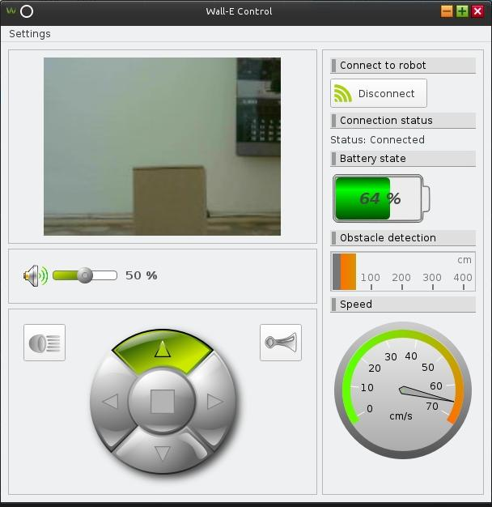
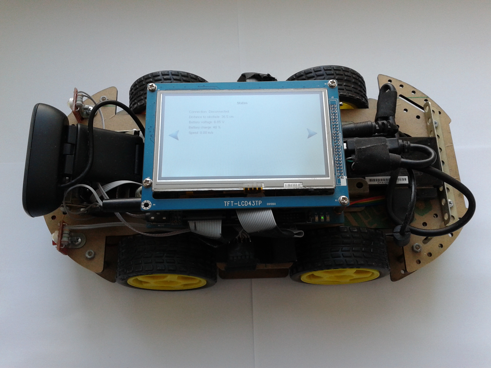
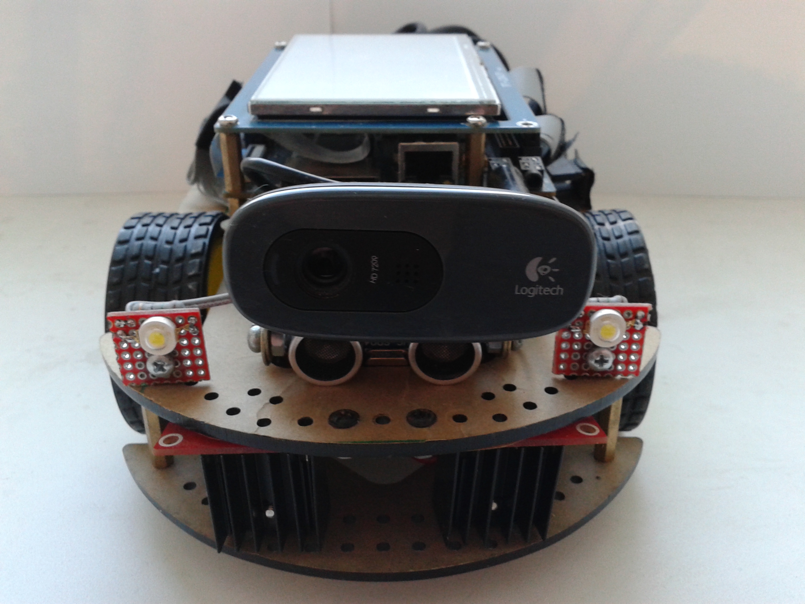

# wall-e
Robot's remote control application suite. 

##Description
Suite consists of two applications: Control application and Remote application. Former is designed to control periferal components and sensors of robot. It provides graphical UI and communication with remote side. Last one is used for remote configuration, monitoring and control. Communication between applications is based on TCP protocol. Both applications are built with open sourse version of Qt. Video and audio streams are implemented using gstreamer and VLC packages. 

Remote application:

Below is reference car robot platform based on AT91SAM9G45-EKES board. The main features are web-camera with video and audio support, four motors, battery, battery sensor, ultrasonic sensor, hall sensor, WiFi AP, horn and headlights. The robot has its own touchscreen display for in place diagnostic and configuration. 
 

## Build

### Remote application requirements:
Windows 7/Kubuntu 14.04: Qt 5.3.2 32bit, g++ 4.9.2, VLC library 2.1.4.

### Control application requirements:
Embedded linux: buildroot-2013.05 (Qt embedded 4.8.4, g++ 4.7.3).  
Kubuntu 14.04: Qt 4.8.4, g++ 4.7.3

##Demo run
Control application and remote application can run on the same PC for demo purposes.  

###Host requirements:
Kubuntu 14.04, gstreamer 0.10.36 + plugins.

###Execute applications:
1. Create ethernet device alias with 192.168.3.1 IP:  
$ sudo ifconfig eth0:0 192.168.3.1 up
1. Execute desktop build of Control application.
1. Execute Remote application and press "Connect" button.
1. After connection is established connection status is "Connected", video from PC web-camera is shown and audio from PC microphone can be heard in headphones.  

##AT91SAM9G45-EKES car robot platform

### Root FS
-  Download Buildroot 2013.05 or later from http://buildroot.uclibc.org.
-  Copy configuration file and update device table:  
   $ cp platform/at91sam9g45-ekes/buildroot-2013.05/.config &lt;Buildroot folder&gt;/  
   $ cp platform/at91sam9g45-ekes/buildroot-2013.05/system/device_table_dev.txt &lt;Buildroot folder&gt;/system/  
   $ mkdir -p &lt;Buildroot folder&gt;/system/skeleton/dev/snd  
   $ make menuconfig  
   $ make  

### Kernel
-  Build Linux 2.6.30 with patches provided along with AT91SAM9G45-EKES boad and configuration file located in platform/at91sam9g45-ekes/linux-2.6.30/ folder. Refer to board's manual.

### Flashing board
-  Program board with default AT91SAM9G45-EKES bootloaders, custom kernel and root FS. Refer to board's manual.

### Battery ADC
-  Linux configuration file turns on support of PCF8591 8-bit ADC used for battery voltage measurements. In order to use this I2C device add its name and address to I2C devices table and recompile kernel:  
arch/arm/mach-at91/board-sam9m10g45ek.c  
static struct i2c_board_info __initdata ek_i2c_devices[] = {  
&nbsp;&nbsp;&nbsp;&nbsp;...  
&nbsp;&nbsp;&nbsp;&nbsp;{  
&nbsp;&nbsp;&nbsp;&nbsp;&nbsp;&nbsp;&nbsp;&nbsp;I2C_BOARD_INFO("pcf8591", 0x48),  
&nbsp;&nbsp;&nbsp;&nbsp;},  
};

### Tochscreen
-  Execute ts_calibrate in order to calibrate touchcreen.
-  Add touchscreen settings export to /etc/profile:  
export TSLIB_TSDEVICE=/dev/input/event1  
export TSLIB_TSEVENTTYPE=INPUT  
export TSLIB_CONFFILE=/etc/ts.conf  
export TSLIB_CALIBFILE=/etc/pointercal  
export QWS_MOUSE_PROTO="Tslib:/dev/input/event1"

### Hall speed sensor driver
-  Build Hall speed driver module from https://github.com/bbogush/hall_speed.
-  Copy hall_speed.ko to board's /home folder:  
sshpass -proot scp hall_speed.ko root@192.168.2.200:/home/hall_speed.ko
-  Add "null::sysinit:/sbin/insmod /home/hall_speed.ko" to board's /etc/inittab file.

### Ultrasonic distance sensor
-  Build Ultrasonic HC-SR04 driver module from https://github.com/tanzilli/hc-sr04.
-  Copy hcsr04.ko to the board:  
sshpass -proot scp hcsr04.ko root@192.168.2.200:/home/hcsr04.ko
-  Add "null::sysinit:/sbin/insmod /home/hcsr04.ko" to board's /etc/inittab file.

### WiFi AP
-  Build TL-WN725N WiFi driver from https://github.com/lwfinger/rtl8188eu:  
make SUBARCH=arm CROSS_COMPILE=/usr/local/arm-2007q1/bin/arm-none-linux-gnueabi- KVER=2.6.30 KSRC=../../linux-2.6.30  
-  Copy 8188eu.ko to the board:  
sshpass -proot scp 8188eu.ko root@192.168.2.200:/home/8188eu.ko
-  Add "null::sysinit:/sbin/insmod /home/8188eu.ko" to board's /etc/inittab file.
-  Copy TL-WN725N firmware rtl8188eu-master/rtl8188eufw.bin to linux-2.6.30/firmware/rtlwifi/ folder, rebuild and flash kernel.
-  Build hostapd from https://github.com/jenssegers/RTL8188-hostapd:  
make CC=/usr/local/arm-2007q1/bin/arm-none-linux-gnueabi-gcc DESTDIR=/home/bogdan/Development/buildroot-2013.05/output/target
-  Copy hostapd to the board:  
sshpass -proot scp hostapd root@192.168.2.200:/sbin/hostapd
-  Copy configuration files to the board:  
sshpass -proot scp platform/at91sam9g45-ekes/etc/hostapd.conf root@192.168.2.200:/etc/udhcpd.conf  
sshpass -proot scp platform/at91sam9g45-ekes/etc/init.d/S42udhcpd root@192.168.2.200:/etc/init.d/S42udhcpd  
sshpass -proot scp platform/at91sam9g45-ekes/etc/init.d/S41hostapd root@192.168.2.200:/etc/init.d/S41hostapd  
sshpass -proot scp platform/at91sam9g45-ekes/etc/hostapd.conf root@192.168.2.200:/etc/hostapd.conf  
sshpass -proot scp platform/at91sam9g45-ekes/etc/network/interfaces root@192.168.2.200:/etc/network/interfaces

### Horn
- Copy horn sound file to the board:  
sshpass -proot scp platform/at91sam9g45-ekes/home/horn_signal.wav root@192.168.2.200:/home/horn_signal.wav

